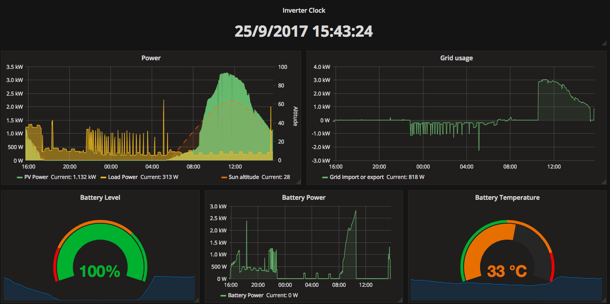

# Sungrow Inverter Real Time Dashboard

Stream your Sungrow Inverter data to a real time dashboard.

Here's an example use case with [Freeboard](https://freeboard.io/) as a real time dashboard 
and data visualization tool for your Sungrow Inverter (and attached battery) system:


## Prequisites

The Sungrow Inverter must be accessible on the network using TCP.

This script should work on most Sungrow Inverters. See the section below on confirmed
models.

Metrics are streamed to [dweet.io](https://dweet.io/) a free IoT messaging service. No sign up is required.

Data is visualised using a free dashboard service from [Freeboard](https://freeboard.io/). 

Install the required Python libraries for pymodbus and dweepy:

```
pip install -r requirements.txt
```

## Installation

1. Download or clone this repository to your local workstation. Install the required
libraries (see Pre-requisites section above).

2. Update the config.py file with your inverter's IP address and give your Inverter a unique name which will be used in dweet.io. Generate a random UUID at [https://www.uuidgenerator.net](https://www.uuidgenerator.net/).

3. Run the sungrow_client.py script.

4. Log in to the [Freeboard](https://freeboard.io/) and create a dashboard using your 
dweet.io data source. 

## The Sungrow Modbus Map

This script works on the following confirmed Sungrow Inverter models:
* SH5K+ (connected to a GCL Battery)

The Sungrow SH5K+ modbus map was generated manually by scraping all registers. There are
still outstanding metrics to be identified. Help me complete the map.

Input registers:
```
5008:  internal_temp
5011:  pv1_voltage
5012:  pv1_current
5013:  pv2_voltage
5014:  pv1_current
5017:  total_pv_power
5019:  grid_voltage
5022:  inverter_current
5031:  consumption?
5036:  grid_frequency
13003: total_pv_energy
13006: total_export_energy
13008: load_power
13010: export_power
13013: total_charge_energy
13015: co2_emission_reduction
13018: total_use_energy
13020: battery_voltage
13022: battery_power
13023: battery_level
13024: battery_health
13025: battery_temp
13027: total_discharge_energy
13029: use_power
13034: pv_power
```

Holding registers:
```
5000: Year
5001: Month
5002: Day
5003: Hour (24hr)
5004: Minute
5005: Second
```

## Extending the Sungrow Modbus Client

### InfluxDB and Grafana

This current script was designed for simplicity. However,
if you wish to roll your own database and dashboard, opportunities exist to 
extend this Sungrow Modbus Client to perform historical analytics and even
alerting for certain monitoring thresholds.

For example, you could extend the client to store the metrics in an Influxdb
and visualise it using Grafana:



Here's a snippet of the relevant code to make the current script talk to
your Influxdb database:

```
from influxdb import InfluxDBClient

# Connect to the Influxdb
influx_client = InfluxDBClient('INFLUX_IP',
                               8086,
                               'INFLUX_USER',
                               'INFLUX_PASSWORD',
                               'SUNGROW_DBNAME')

    [snip]

    metrics = {}
    tags = {}
    metrics['measurement'] = "Inverter Name"
    tags['location'] = "Inverter Location"
    metrics['tags'] = tags
    metrics['fields'] = inverter
    print metrics
    # Send to Influxdb
    influx_client.write_points([metrics])
```

### Integration with PVOutput.org and Grafana

If you are using Grafana as your dashboard, a neat little trick is to then
incorporate your Grafana panels with your PVOutput as system photos. From your
PV Ladder page, click on your photos to view the real time Grafana images: 


1. Obtain your Grafana panel direct link, see their documentation: <http://docs.grafana.org/reference/sharing/#direct-link-rendered-image>.

2. In your PVOutput "Edit System" page, add your Grafana panel link in the 
"Image Link" field. Append "&png" to the link. Note, if the URL is longer than 
100 characters, use a URL shortener service instead (such as <https://goo.gl>).
Don't forget to append the "&png" string to your URL.

3. Now go to your system in the PV Ladder page and click on the photos.

Pro tip: You can add any URL image, such as a BOM radar image :wink:


